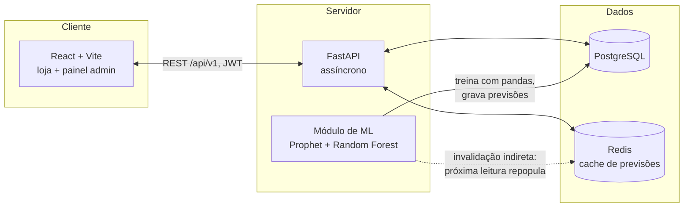

# Loja Virtual de Roupas com Estoque Inteligente e Predição de Tendências (TCC)

Plataforma que une **e-commerce + controle de estoque + Machine Learning** em
um único sistema — diferente de soluções corporativas de previsão de estoque
(que não têm loja integrada) e de trabalhos acadêmicos que tratam previsão de
vendas ou gestão de estoque isoladamente. A decisão final de compra/reposição
é **sempre humana**: o ML apenas prevê demanda e sugere reposição.

## Arquitetura



| Camada | Tecnologia | Papel |
|---|---|---|
| Front-end | React + TypeScript (Vite) | Loja (catálogo/carrinho/checkout) + painel administrativo com dashboards |
| API | FastAPI (async) | Endpoints REST, documentação automática (Swagger/OpenAPI) |
| Banco | PostgreSQL | Histórico de vendas, catálogo, estoque, pedidos, previsões — fonte única de verdade |
| Cache | Redis | Cache das previsões de ML (evita reprocessar Prophet/Random Forest a cada requisição) |
| ML | pandas + Prophet + scikit-learn (Random Forest) | Sazonalidade/tendências (Prophet) + demanda por item (Random Forest) |

Justificativas técnicas detalhadas de cada decisão de arquitetura estão nos
próprios READMEs de cada módulo (linkados abaixo) — foram escritas para
serem citadas na defesa do TCC.

## Estrutura do repositório

```
database/
├── schema.sql          # DDL completo do PostgreSQL (Etapa 1)
└── seed/                # gerador do dataset sintético de vendas (Etapa 6)
backend/
├── app/
│   ├── core/             # config, conexão DB/Redis, segurança (JWT)
│   ├── models/            # SQLAlchemy — espelha database/schema.sql
│   ├── schemas/            # Pydantic — contratos da API
│   ├── services/            # regras de negócio (checkout, movimentação de estoque)
│   ├── api/v1/endpoints/     # routers (catálogo, carrinho, pedidos, estoque, relatórios, ML)
│   └── ml/                    # features, Prophet, Random Forest, orquestração de treino (Etapa 3)
├── scripts/seed_database.py   # popula o Postgres com o dataset sintético
└── requirements.txt
frontend/
└── src/                        # loja + painel admin (Etapa 4) — ver frontend/README.md
docs/
├── er-diagram.md                # diagrama ER + decisões de modelagem
├── kanban.md                     # quadro Kanban do projeto (metodologia)
├── ml-results.md                  # métricas reais dos modelos + discussão para a defesa
└── integration.md                   # como as camadas se conectam (Etapa 5)
```

## Quickstart (rodando tudo localmente)

Pré-requisitos: Docker Desktop (para Postgres/Redis — `docker-compose.yml` na raiz), Python 3.13, Node.js 20.
Veja o guia passo a passo para **Windows/PowerShell** em [`docs/rodando-no-windows.md`](docs/rodando-no-windows.md).

```bash
# 1. Infraestrutura (Postgres + Redis)
docker compose up -d
docker compose exec postgres psql -U postgres -d ecommerce_ml -f /database/schema.sql

# 2. Back-end
cd backend
python -m venv .venv && source .venv/bin/activate   # Linux/Mac; no Windows: .venv\Scripts\Activate.ps1
pip install -r requirements.txt
cp .env.example .env                                  # valores padrão já batem com o docker-compose

python -m scripts.seed_database                   # popula catálogo + 2 anos de vendas sintéticas
python -m app.ml.train --source db                # treina Prophet + Random Forest, grava previsões

uvicorn app.main:app --reload                     # API em http://localhost:8000 (Swagger em /docs)

# 3. Front-end (em outro terminal)
cd frontend
npm install
npm run dev                                       # loja + painel admin em http://localhost:5173
```

Veja [`docs/integration.md`](docs/integration.md) para o checklist completo
de verificação end-to-end e os diagramas de sequência de cada fluxo.

## Metodologia

O desenvolvimento foi organizado em quadro Kanban (Backlog → A Fazer → Em
Progresso → Em Revisão → Concluído), com entregas incrementais por módulo —
ver [`docs/kanban.md`](docs/kanban.md).

## Contas de demonstração

Após rodar o seed (`python -m scripts.seed_database`), senha `Senha@123` para todas:

| Papel | E-mail |
|---|---|
| Admin | admin@loja.com |
| Gestor de estoque | gestor@loja.com |
| Operador de estoque | estoque@loja.com |
| Cliente | cliente1@exemplo.com … cliente40@exemplo.com |