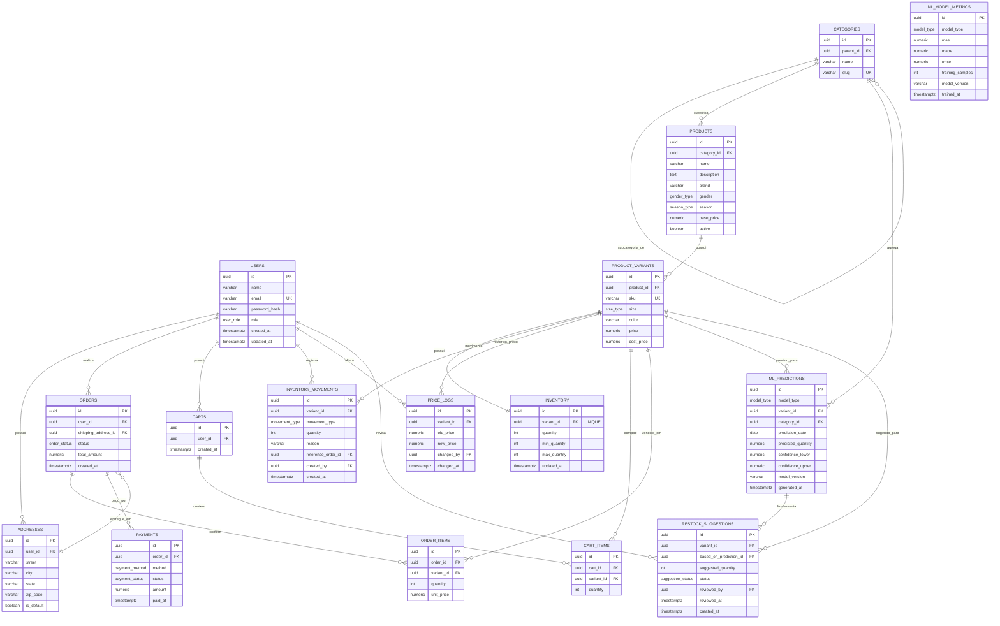

# Diagrama Entidade-Relacionamento (ER)

> Renderizável no GitHub, GitLab, VS Code (extensão Mermaid) e em ferramentas como o [Mermaid Live Editor](https://mermaid.live).
> Este diagrama corresponde 1:1 ao schema em [`../database/schema.sql`](../database/schema.sql).

## Decisões de modelagem (para a defesa do TCC)

1. **`products` vs `product_variants`** — um produto de vestuário (ex: "Camiseta Básica Oversized") tem várias combinações de tamanho/cor, cada uma com SKU e estoque próprios. Separar as duas entidades evita duplicar nome/descrição/categoria a cada variante e é o modelo padrão de e-commerces de moda (mesma abordagem usada por Shopify e VTEX).
2. **`inventory` (snapshot) + `inventory_movements` (log)** — a tabela `inventory` guarda a *quantidade atual* (leitura rápida no catálogo/checkout), enquanto `inventory_movements` é o *livro-razão* de entradas/saídas. Isso permite auditar todo movimento sem recalcular somas a cada requisição, e é a fonte de dados para o treinamento dos modelos de ML (histórico de vendas = saídas do tipo `venda`).
3. **`price_logs` separado de `product_variants.price`** — a coluna `price` sempre reflete o preço vigente; toda alteração gera uma linha em `price_logs`, atendendo ao requisito de "logs de precificação" e permitindo análises futuras de elasticidade de preço.
4. **`ml_predictions` e `ml_model_metrics` desacoplados dos produtos** — previsões são dados derivados (recalculáveis), não fonte de verdade. Guardá-las no Postgres (além do cache Redis) permite auditoria histórica de acurácia e comparação de versões de modelo ao longo do tempo — importante para a seção de resultados do TCC.
5. **`restock_suggestions` com campo `status`** — implementa o requisito de que a IA **sugere**, mas a decisão final é humana: toda sugestão nasce `pendente` e só é efetivada (gerando uma `inventory_movement` de entrada) depois que um gestor aprova.
6. **UUID como chave primária** — evita IDs sequenciais previsíveis expostos via API pública (catálogo) e facilita merge de dados entre ambientes (dev/seed/produção) sem colisão de PKs.
