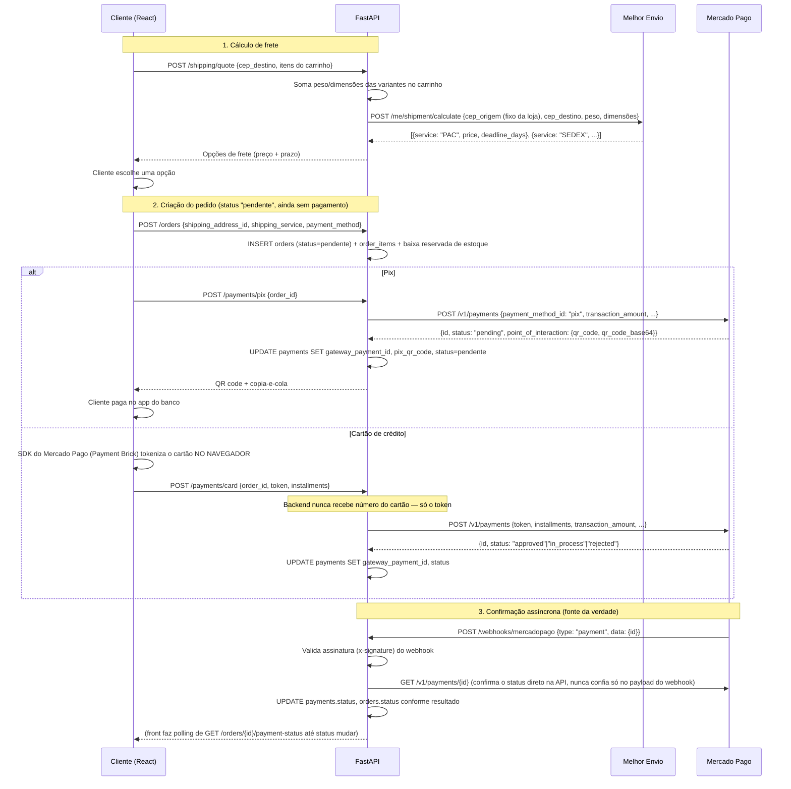

# Frete e Pagamento — arquitetura de integração

Documento de design para integrar **cálculo de frete** e **pagamento (Pix +
cartão)** ao sistema, com foco em conformidade LGPD/PCI-DSS. Ainda **não
implementado** — este arquivo é o projeto técnico; a implementação é o
próximo passo (ver seção 6).

## 1. Escolha de plataformas e APIs

### 1.1 Gateway de pagamento

| Gateway | Pix | Cartão + parcelamento | Tokenização client-side | Doc PT-BR | Custo/mensalidade | Facilidade p/ sandbox de TCC |
|---|---|---|---|---|---|---|
| **Mercado Pago** | Nativo, QR code + copia-e-cola via API | Sim (Checkout Bricks/Payment Brick) | Sim (SDK JS oficial) | Excelente | Sem mensalidade, só % por transação | ⭐ Melhor — sandbox e credenciais de teste sem CNPJ |
| **Pagar.me (Stone)** | Nativo | Sim, forte em split de marketplace | Sim (Pagar.me.js) | Boa | Sem mensalidade | Boa, mas onboarding um pouco mais burocrático |
| **Asaas** | Nativo | Sim | Sim | Boa | Sem mensalidade (planos pagos são opcionais) | Boa — bom pacote "tudo em um" (boleto/NF-e também) |
| **PagBank (PagSeguro)** | Nativo | Sim | Sim | Mediana | Sem mensalidade | Mediana |
| **Stripe** | Suporte a Pix mais recente/limitado no Brasil | Excelente, mas parcelamento "sem juros da loja" (padrão brasileiro) não é nativo | Sim (melhor SDK do mercado) | Em inglês majoritariamente | Sem mensalidade | Boa para cartão, fraca para Pix |

**Recomendação para este projeto: Mercado Pago.**
Motivos: Pix e cartão na mesma plataforma, SDK **Checkout Bricks** faz a
tokenização do cartão inteiramente no navegador (o backend nunca vê o
número do cartão), documentação em português muito completa, e é possível
gerar credenciais de teste e simular pagamentos sem CNPJ — ideal para
demonstrar na defesa do TCC sem custo e sem burocracia de habilitação de
conta PJ.

### 1.2 API de frete

| API | Cobertura | Facilidade de integração | Sandbox gratuito |
|---|---|---|---|
| **Melhor Envio** | Agrega Correios, Jadlog, Azul Cargo etc. | Alta — uma API só para cotar e depois gerar etiqueta | Sim, ambiente sandbox completo |
| Frenet | Agrega múltiplas transportadoras | Alta | Sim |
| Correios (API direta) | Só Correios | Baixa — exige contrato/cartão de postagem | Não tem sandbox público simples |
| Kangu | Agrega transportadoras regionais | Média | Limitado |

**Recomendação: Melhor Envio.** Cobre a maioria dos casos de uma loja de
médio porte, tem sandbox gratuito e retorna várias opções de frete (PAC,
SEDEX, transportadoras) numa única chamada — o que já dá o "combo"
preço/prazo que o cliente vê no checkout.

## 2. Arquitetura e fluxo de integração

### 2.1 O que precisa ser adicionado ao schema atual

O schema já tem `addresses`, `orders`, `payments` — faltam os dados físicos
dos produtos (peso/dimensões) e os campos que amarram um pedido/pagamento
ao provedor externo:

```sql
-- product_variants precisa de peso/dimensões para cotar frete
ALTER TABLE product_variants
    ADD COLUMN weight_grams INTEGER NOT NULL DEFAULT 300,
    ADD COLUMN height_cm NUMERIC(6,2) NOT NULL DEFAULT 3,
    ADD COLUMN width_cm NUMERIC(6,2) NOT NULL DEFAULT 25,
    ADD COLUMN length_cm NUMERIC(6,2) NOT NULL DEFAULT 35;

-- orders precisa registrar o frete escolhido no checkout
ALTER TABLE orders
    ADD COLUMN shipping_service VARCHAR(60),   -- ex: "PAC", "SEDEX"
    ADD COLUMN shipping_cost NUMERIC(10,2) NOT NULL DEFAULT 0,
    ADD COLUMN shipping_deadline_days INTEGER;

-- payments precisa dos dados do gateway (nunca dados de cartão)
ALTER TABLE payments
    ADD COLUMN gateway VARCHAR(30) NOT NULL DEFAULT 'mercadopago',
    ADD COLUMN gateway_payment_id VARCHAR(100) UNIQUE,  -- id da transação no gateway
    ADD COLUMN installments INTEGER,
    ADD COLUMN card_brand VARCHAR(20),      -- ex: "visa" — só a bandeira, nunca o número
    ADD COLUMN card_last4 VARCHAR(4),       -- só os 4 últimos dígitos, devolvidos pelo próprio gateway
    ADD COLUMN pix_qr_code TEXT,            -- payload copia-e-cola (só enquanto pendente)
    ADD COLUMN pix_qr_code_base64 TEXT;     -- imagem do QR code (só enquanto pendente)
```

`gateway_payment_id UNIQUE` é o que garante idempotência: se o webhook do
gateway chegar duplicado, o `INSERT`/lookup por esse campo evita processar
o mesmo pagamento duas vezes.

### 2.2 Fluxo de checkout — do CEP à confirmação



Pontos-chave:
- **O frete é cotado ANTES de criar o pedido** — evita gravar pedidos com
  frete inválido/CEP errado no banco.
- **O pedido nasce `pendente`** e só muda de status quando o **webhook**
  confirma o pagamento — nunca no retorno síncrono da chamada de criação
  do pagamento (principalmente no Pix, que é assíncrono por natureza: o
  cliente ainda vai abrir o app do banco depois da QR code aparecer).
- **Estoque é reservado na criação do pedido**, não na confirmação do
  pagamento — evita vender a mesma peça duas vezes enquanto um pagamento
  Pix está pendente (e é liberado de volta se o pagamento expirar/for
  recusado).

### 2.3 Webhook vs. polling — os dois, com papéis diferentes

Não é "webhook OU polling" — são complementares:

| | Webhook | Polling |
|---|---|---|
| Papel | **Fonte da verdade** — atualiza o pedido no banco assim que o gateway confirma | **UX** — o front pergunta ao seu próprio backend "já mudou?" enquanto a tela de pagamento está aberta |
| Quem chama quem | Gateway → seu backend | Seu front → seu backend (nunca direto no gateway) |
| Confiança | Só depois de validar a assinatura E reconsultar a API do gateway pelo ID | Só reflete o que já está no seu banco (nunca decide nada sozinho) |
| Se falhar | Gateway reenvia automaticamente (todos os gateways citados têm retry) — mas tenha um job de reconciliação que consulta pedidos "pendente" há mais de N minutos como rede de segurança | Se a aba fechar, não importa — o webhook já vai ter atualizado o banco |

Nunca libere o pedido (baixa definitiva de estoque, e-mail de confirmação,
nota fiscal) só porque a chamada de criação do pagamento devolveu
`"approved"` — sempre trate isso como *provisório* até o webhook confirmar,
porque cartão pode entrar em `in_process` e mudar depois, e Pix nunca vem
aprovado na resposta síncrona.

## 3. Segurança e proteção de dados

### 3.1 PCI-DSS — como ficar no escopo mais simples (SAQ A)

- **O número do cartão, CVV e validade nunca devem chegar ao seu backend**,
  nem de passagem, nem em log, nem em variável temporária. O SDK JS do
  gateway (ex.: Mercado Pago `Payment Brick`) roda **no navegador do
  cliente** e manda os dados direto para os servidores do gateway via
  iframe/HTTPS, devolvendo um **token de uso único**. Seu backend só recebe
  esse token — nunca o dado bruto. Isso qualifica o sistema no **SAQ A**
  (o questionário PCI-DSS mais simples, sem exigir auditoria de
  infraestrutura de cartão).
- **Nunca implemente um `<input>` de número de cartão que envie o valor
  para o seu próprio backend** — isso tira você do SAQ A e exige
  certificação completa PCI-DSS.
- Guarde só o que o próprio gateway devolve como "seguro para guardar":
  bandeira (`visa`), últimos 4 dígitos, e o `gateway_payment_id`. Nunca o
  PAN completo, nunca o CVV (aliás, nenhum gateway sério permite guardar
  CVV).
- **Valide a assinatura de todo webhook** (Mercado Pago manda um header
  `x-signature` HMAC-SHA256 com um segredo que só você e o gateway
  conhecem) — sem isso, qualquer um poderia forjar um POST pro seu endpoint
  de webhook dizendo "pagamento aprovado".
- **Idempotência**: trate o mesmo `gateway_payment_id` chegando duas vezes
  (webhook duplicado é normal) sem processar a confirmação/baixa de
  estoque duas vezes — usar `UNIQUE` na coluna resolve isso no nível do
  banco.

### 3.2 LGPD

- **Minimização de dados**: só colete CPF se for realmente necessário
  (nota fiscal); não peça nada "para o futuro".
- **Criptografia em repouso** para dados pessoais sensíveis (CPF, se
  coletado) — usar `pgcrypto` do Postgres (já usado no projeto para
  `gen_random_uuid()`) para criptografar a coluna, ou criptografar na
  camada da aplicação antes de gravar.
- **HTTPS obrigatório** em produção — já coberto no `SECURITY.md`.
- **Direito de acesso/exclusão**: prever um endpoint (mesmo que só para
  staff, sob pedido do titular) para exportar ou anonimizar os dados de um
  cliente — pedidos históricos podem ser mantidos por obrigação fiscal,
  mas dados de perfil (nome, e-mail, endereço) devem poder ser anonimizados
  a pedido.
- **Log sem dado sensível**: nunca logar o corpo completo de
  requests/webhooks de pagamento (podem conter e-mail, CPF, endereço) em
  nível `INFO`/`DEBUG` de produção — logar só IDs.
- **Consentimento**: se houver qualquer uso de dados para marketing
  (ex.: newsletter), precisa de opt-in explícito e registro de quando foi
  dado.

## 4. Exemplo de código (FastAPI, no padrão já usado no projeto)

### 4.1 Cálculo de frete

```python
# backend/app/schemas/shipping.py
from pydantic import BaseModel

class ShippingQuoteRequest(BaseModel):
    cep_destino: str
    variant_ids_and_quantities: list[tuple[str, int]]  # [(variant_id, quantity), ...]

class ShippingOption(BaseModel):
    service: str          # "PAC", "SEDEX", etc.
    price: float
    deadline_days: int

class ShippingQuoteResponse(BaseModel):
    options: list[ShippingOption]
```

```python
# backend/app/api/v1/endpoints/shipping.py
import httpx
from fastapi import APIRouter, Depends, HTTPException, status
from sqlalchemy import select
from sqlalchemy.ext.asyncio import AsyncSession

from app.core.config import settings
from app.core.database import get_db
from app.models.catalog import ProductVariant
from app.schemas.shipping import ShippingOption, ShippingQuoteRequest, ShippingQuoteResponse

router = APIRouter(prefix="/shipping", tags=["Frete"])

CEP_ORIGEM = "01310-100"  # CEP fixo do centro de distribuição da loja


@router.post("/quote", response_model=ShippingQuoteResponse)
async def quote_shipping(payload: ShippingQuoteRequest, db: AsyncSession = Depends(get_db)) -> ShippingQuoteResponse:
    variant_ids = [vid for vid, _ in payload.variant_ids_and_quantities]
    result = await db.execute(select(ProductVariant).where(ProductVariant.id.in_(variant_ids)))
    variants = {str(v.id): v for v in result.scalars().all()}

    total_weight = 0
    max_height = max_width = max_length = 0
    for variant_id, quantity in payload.variant_ids_and_quantities:
        v = variants.get(variant_id)
        if v is None:
            raise HTTPException(status.HTTP_404_NOT_FOUND, f"Variante {variant_id} não encontrada")
        total_weight += v.weight_grams * quantity
        max_height = max(max_height, float(v.height_cm))
        max_width = max(max_width, float(v.width_cm))
        max_length += float(v.length_cm) * quantity  # simplificação: empacotamento real é mais sofisticado

    async with httpx.AsyncClient(timeout=10) as client:
        resp = await client.post(
            "https://sandbox.melhorenvio.com.br/api/v2/me/shipment/calculate",
            headers={"Authorization": f"Bearer {settings.MELHOR_ENVIO_TOKEN}"},
            json={
                "from": {"postal_code": CEP_ORIGEM},
                "to": {"postal_code": payload.cep_destino},
                "package": {
                    "weight": total_weight / 1000,  # kg
                    "height": max_height,
                    "width": max_width,
                    "length": max_length,
                },
            },
        )
    resp.raise_for_status()
    data = resp.json()

    options = [
        ShippingOption(service=item["name"], price=float(item["price"]), deadline_days=item["delivery_time"])
        for item in data
        if "error" not in item
    ]
    return ShippingQuoteResponse(options=options)
```

### 4.2 Webhook de pagamento (Mercado Pago)

```python
# backend/app/api/v1/endpoints/webhooks.py
import hashlib
import hmac

import httpx
from fastapi import APIRouter, Depends, Header, HTTPException, Request, status
from sqlalchemy import select
from sqlalchemy.ext.asyncio import AsyncSession

from app.core.config import settings
from app.core.database import get_db
from app.models.commerce import Payment
from app.models.enums import OrderStatus, PaymentStatus

router = APIRouter(prefix="/webhooks", tags=["Webhooks"])


def _valid_signature(x_signature: str, x_request_id: str, data_id: str) -> bool:
    """Recria a assinatura conforme a doc do Mercado Pago e compara em tempo
    constante — nunca confie num webhook sem validar isso primeiro."""
    parts = dict(p.split("=", 1) for p in x_signature.split(","))
    manifest = f"id:{data_id};request-id:{x_request_id};ts:{parts['ts']};"
    expected = hmac.new(settings.MERCADO_PAGO_WEBHOOK_SECRET.encode(), manifest.encode(), hashlib.sha256).hexdigest()
    return hmac.compare_digest(expected, parts["v1"])


@router.post("/mercadopago", status_code=status.HTTP_200_OK)
async def mercadopago_webhook(
    request: Request,
    db: AsyncSession = Depends(get_db),
    x_signature: str = Header(...),
    x_request_id: str = Header(...),
) -> dict[str, str]:
    body = await request.json()
    if body.get("type") != "payment":
        return {"status": "ignored"}

    payment_id = str(body["data"]["id"])
    if not _valid_signature(x_signature, x_request_id, payment_id):
        raise HTTPException(status.HTTP_401_UNAUTHORIZED, "Assinatura inválida")

    # Nunca confia só no payload do webhook — reconsulta a API do gateway
    # pelo ID para pegar o status real e autoritativo.
    async with httpx.AsyncClient(timeout=10) as client:
        resp = await client.get(
            f"https://api.mercadopago.com/v1/payments/{payment_id}",
            headers={"Authorization": f"Bearer {settings.MERCADO_PAGO_ACCESS_TOKEN}"},
        )
    resp.raise_for_status()
    gateway_data = resp.json()

    result = await db.execute(select(Payment).where(Payment.gateway_payment_id == payment_id))
    payment = result.scalar_one_or_none()
    if payment is None:
        return {"status": "unknown_payment"}  # idempotência: evento de um pagamento que não é nosso

    status_map = {"approved": PaymentStatus.aprovado, "rejected": PaymentStatus.recusado}
    new_status = status_map.get(gateway_data["status"])
    if new_status and payment.status != new_status:
        payment.status = new_status
        if new_status == PaymentStatus.aprovado:
            payment.order.status = OrderStatus.pago
        await db.commit()

    return {"status": "processed"}
```

### 4.3 Tokenização do cartão no front-end (nunca no backend)

```tsx
// Trecho ilustrativo — SDK oficial do Mercado Pago carregado via <script>
// (https://sdk.mercadopago.com/js/v2). O token gerado aqui é o ÚNICO dado
// de cartão que chega ao nosso backend.
const mp = new window.MercadoPago(MERCADO_PAGO_PUBLIC_KEY);

async function handleCardSubmit(cardNumber: string, expiry: string, cvv: string, holderName: string) {
  const { id: token } = await mp.createCardToken({
    cardNumber,
    cardExpirationMonth: expiry.split("/")[0],
    cardExpirationYear: expiry.split("/")[1],
    securityCode: cvv,
    cardholderName: holderName,
  });

  // Só o token vai para o nosso backend — número/CVV nunca saem do navegador.
  await api.post("/payments/card", { order_id: orderId, token, installments });
}
```

## 5. Novas variáveis de ambiente

```bash
# backend/.env
MELHOR_ENVIO_TOKEN=...
MERCADO_PAGO_ACCESS_TOKEN=...       # chave privada, só no backend
MERCADO_PAGO_PUBLIC_KEY=...          # chave pública, exposta no front (isso é esperado/seguro)
MERCADO_PAGO_WEBHOOK_SECRET=...
```

Como sempre neste projeto: nunca commitar os valores reais — só o
`.env.example` com placeholders.

## 6. Plano de implementação sugerido

Ordem recomendada, cada item é incremental e testável isoladamente:

1. Migração de schema (seção 2.1) + atualizar `docs/er-diagram.md`.
2. `POST /shipping/quote` (seção 4.1) + tela de CEP no carrinho/checkout.
3. Conta sandbox no Mercado Pago + `POST /payments/pix` e a tela de QR code.
4. `POST /webhooks/mercadopago` (seção 4.2) + endpoint de polling
   `GET /orders/{id}/payment-status` para o front consultar.
5. Checkout Bricks no front (tokenização) + `POST /payments/card` (seção 4.3).
6. Job de reconciliação (roda a cada alguns minutos, consulta na API do
   Mercado Pago qualquer pagamento "pendente" há mais de N minutos) como
   rede de segurança para webhooks perdidos.
7. Atualizar `SECURITY.md` com os novos itens.

Este documento cobre o **design**; me avise quando quiser que eu implemente
algum desses itens no código.
