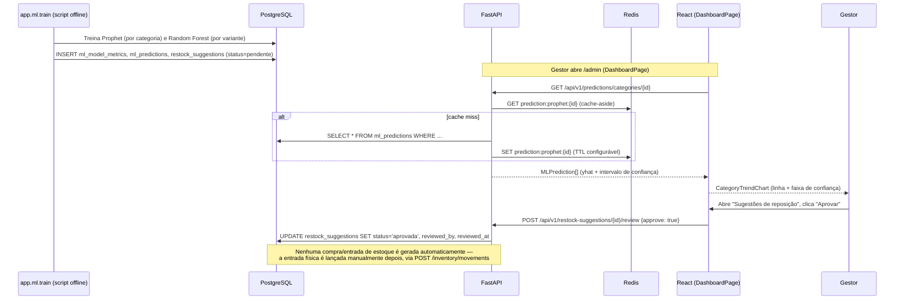

# Integração completa (Etapa 5)

Como as quatro peças do sistema (PostgreSQL, Redis, FastAPI, React) e os
dois modelos de ML se conectam, ponta a ponta.

## 1. Como o React consome a API FastAPI

```mermaid
sequenceDiagram
    participant U as Usuário (navegador)
    participant R as React (Vite dev server :5173)
    participant A as FastAPI (:8000)
    participant DB as PostgreSQL
    participant C as Redis

    U->>R: Acessa /produtos/:id, clica "Adicionar ao carrinho"
    R->>A: POST /api/v1/cart/items (Authorization: Bearer <JWT>)
    A->>DB: INSERT/UPDATE cart_items
    A-->>R: CartRead (itens + preço + nome do produto)
    R-->>U: Atualiza contador do carrinho (zustand: cartStore)

    U->>R: Confirma pedido no checkout
    R->>A: POST /api/v1/orders {shipping_address_id, payment_method}
    A->>DB: INSERT orders + order_items + payments;<br/>baixa de estoque via inventory_movements (saida)
    A-->>R: OrderRead
    R-->>U: Redireciona para /meus-pedidos
```

Pontos-chave:
- **Vite faz proxy de `/api` para `http://localhost:8000`** (`frontend/vite.config.ts`) — em desenvolvimento, o React nunca precisa saber a porta real do back-end, e não há problema de CORS entre `:5173` e `:8000`.
- **Todo request autenticado carrega o JWT** via interceptor do Axios (`frontend/src/api/client.ts`), que também desloga automaticamente o usuário em caso de `401`.
- **Cada domínio tem seu próprio módulo de API tipado** (`frontend/src/api/*.ts`), espelhando 1:1 os routers do back-end (`backend/app/api/v1/endpoints/*.py`) — facilita rastrear qual endpoint alimenta qual tela.

## 2. Como as previsões de ML chegam ao dashboard



Pontos-chave:
- **O treinamento (`app.ml.train`) é desacoplado do runtime da API** — roda como um script separado (ver `backend/app/ml/README.md`), o que é o padrão esperado para ML em produção (retreinar não deve exigir redeploy da API). Reexecutar o treinamento apenas substitui as linhas em `ml_predictions`/`ml_model_metrics`/`restock_suggestions`.
- **Redis é só cache de leitura (cache-aside), nunca fonte de verdade** — se o Redis for limpo, a próxima requisição recalcula a partir do Postgres e repopula o cache automaticamente (`backend/app/api/v1/endpoints/predictions.py::_cached_predictions`).
- **A aprovação humana é obrigatória e não há atalho no código** para transformar uma sugestão em movimento de estoque automaticamente — reforça o requisito do TCC de que a decisão final de compra é sempre do gestor.

## 3. Checklist de verificação end-to-end

1. `psql "$DATABASE_URL" -f database/schema.sql` — cria as tabelas.
2. `cd backend && python -m scripts.seed_database` — popula catálogo + 2 anos de histórico de vendas sintético.
3. `python -m app.ml.train --source db` — treina os modelos e grava previsões/sugestões.
4. `uvicorn app.main:app --reload` — sobe a API em `:8000`; Swagger em `/docs`.
5. `cd frontend && npm run dev` — sobe o React em `:5173`.
6. Login como `gestor@loja.com` (senha `Senha@123`) → `/admin` deve mostrar gráficos de vendas, a previsão de tendência por categoria e sugestões de reposição pendentes.
7. Login como um cliente (`cliente1@exemplo.com`) → navegar no catálogo, adicionar ao carrinho, finalizar compra → o pedido deve aparecer em `/meus-pedidos` e o estoque da variante comprada deve diminuir (visível em `/admin/estoque`).